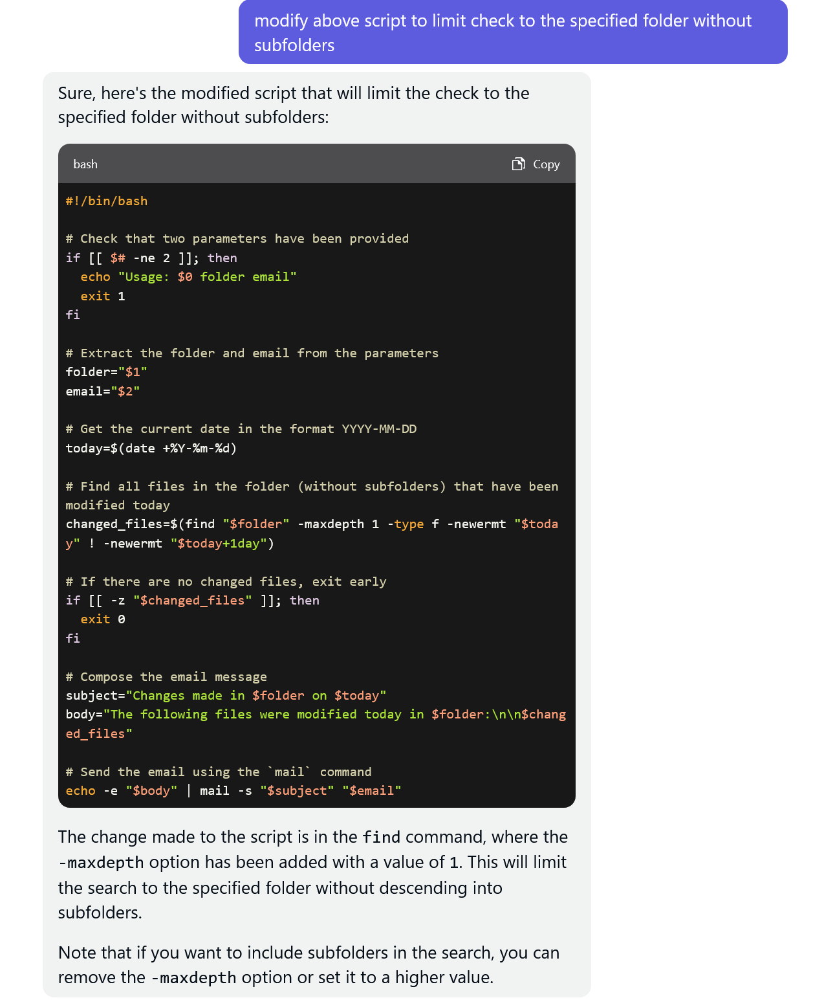
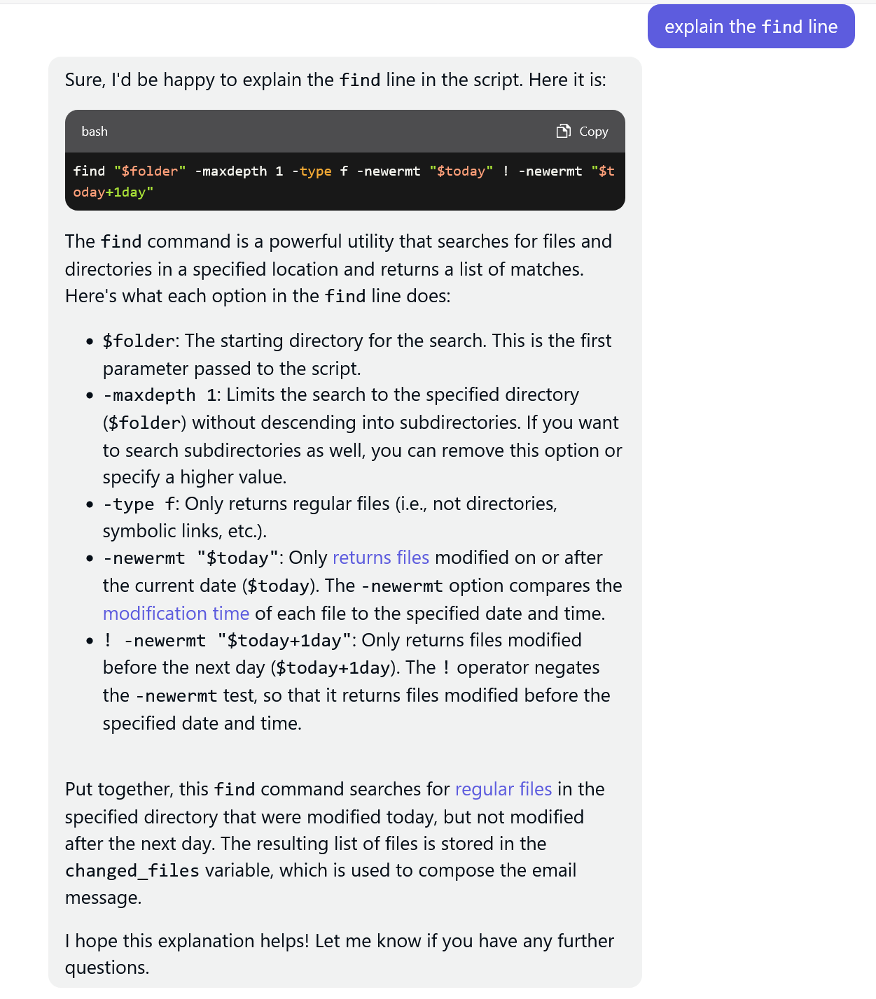
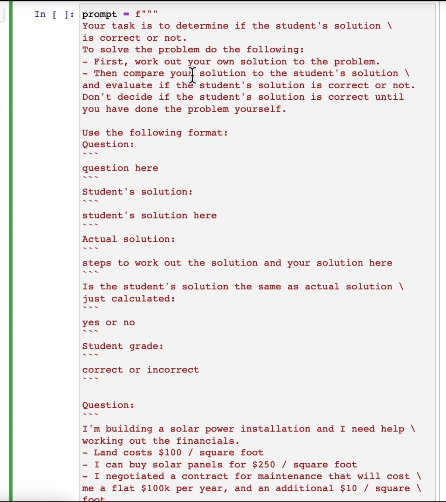

# AI Tools For Developers

* This is a short session for introducing AI tools (**ChatGPT** and **CoPilot** specifically) to developers

    *  How to benefit from them

    *  Basics of prompt engineering

    *  Concerns

    *  Future outlook

---

# ChatGPT

### LLM = Large Language Model

### GPT = Generative Pre-trained Transformer
### In Arabic: مولد مدرب مسبقا بنموذج التحويلات
### Accessing ChatGPT :(
--- 

---

## ChatGPT as your personal coding assistant
--- 

## Writing simple functions in any language (1/2)

--- 

## Writing simple functions in any language (2/2)

--- 

## Writing a bash script to automate a complex task

--- 

## modifying generated code

--- 

## Explaining code

--- 

## A comprehensive practical example

### [A small `docker-compose` project](https://poe.com/s/6Omq7wDLLVmFVQITyhWJ)

--- 
## UI design

### [UI design example](https://poe.com/s/VbDBbFQcaqlE346lDCrc)

### [Output page](ui-design.html)

--- 
## Prompt "engineering" process

1. Get the input(s) you'd like to process (from user, db, scraping, .. etc)

2. Prepare the prompt

3. Test the prompt and adjust as necessary

---

---

## STEP 1: Get the input(s) you'd like to process

---

## STEP 2: Prepare the prompt ...

---

## 1. Instruct ChatGPT to process the input

  
---

## 2. Specify the input delimiter

     
---

## 3. Specify the requested output

  
---

## 4. Specify the output format

  
---

## 5. (optional for few-shot prompts) Provide one or more example inputs and outputs

  
---

## 6. Insert the input inside delimiters

  
---

## 7. Important for large scale usage: try to minimize the prompt length without sacrificing detail and clarity in order to minimize the number of input tokens (to reduce API usage costs)
  
---

## STEP 3: Test the prompt and adjust as necessary

--- 

## Example applications

---

## Python boilerplate for interacting with ChatGPT API

---
## Adding variety (creativity, fun, .. etc) to model response

---
## Summarize customer feedback

### - from an e-commerce website for: shipping department, pricing department, quality control.
### - Enhancement: ~~summarize~~ => extract.

--- 
## Marking student answers to a question

### 2 inputs: question, student answer
  
#### Ask ChatGPT to solve the the question first then compare the answer to the student answer.
  

---
## Inference

### - Sentiment analysis
### - Identifying emotions
### - Extracting information
### - Categorization

---

## Sentiment analysis
  

  
---
## Identifying emotions
  

    
---
## Detecting anger
  

    
### Testimonials (replace `anger` in above prompt with `excitement` or `enthusiasm`)
  
---
## Information extraction
  

    
---
## Extract keywords from an article:
  

    
---
## Categorize post using list of topics
  

---

## Automated replies to customer reviews
  
#### *Tip*: increase the `temperature` to maybe `0.7` for a less monotonic response.
  

  
---

## **PRO TIP:**
    
#### If you need to use the *same input* to get *multiple outputs*, use a ***single prompt*** to reduce cost and time:
  

    
---
## LLM vs "traditional" ML

### - No need to go through the ***complex***, ***expensive***, ***time-consuming*** process of preparing a training dataset, labeling, training, .. etc.
### - One API to rule them all!

---
## Improving output

#### Reducing hallucinations

> {Question}? First find relevent information, then answer the question based on relevent information

---
## CoPilot

### About, installing

### CoPilot vs ChatGPT

---

## Are programmers going to be replaced by robots?

---

### I asked ChatGPT this question:

> how can junior software developers be prepared for their future careers without fear of being replaced by LLMs?

---

### And here is its really insightful answer:

---

#### 1. Understand LLMs' limitations: Recognize that LLMs, like ChatGPT, can generate code quickly but may lack context and real-world understanding, resulting in suboptimal or incorrect solutions.

   
اعرف قدرات نماذج اللغة الكبيرة وعيوبها: اعرف إن نماذج اللغة الكبيرة زي تشات جى بى تى بيعملوا كود بسرعة بس ممكن يكون ناقص سياق أو فهم للوضع الحقيقي، وده بيخلي الحلول مش مثلى أو غلط.

---

#### 2. Emphasize code quality and optimization: Focus on writing high-quality, maintainable, and optimized code, as LLMs may not always generate the best or most efficient solutions.

   اهتم بجودة الكود وتحسينه: حاول تكتب كود بجودة عالية وسهل الصيانة ومحسن، عشان نماذج اللغة الكبيرة ممكن مايعملش دايما الحلول الأفضل ولا الأكتر كفاءة.

---

#### 3. Develop expertise in code review and debugging: Hone your skills in reviewing and debugging code, as LLM-generated code may require human intervention to ensure correctness, efficiency, and adherence to best practices.

   زود خبرتك فى مراجعة الكود وتصحيح الأخطاء: اشتغل على مهاراتك فى مراجعة الكود وتصحيح الأخطاء، عشان الكود اللى بيعمله نماذج اللغة الكبيرة ممكن يحتاج تدخل بشرى عشان يتأكد من صحته وكفاءته ومطابقته لأفضل الممارسات.

---

#### 4. Leverage LLMs as productivity tools: Instead of fearing LLMs, learn to use them as tools to boost your productivity by generating code snippets, documentation, or solving repetitive tasks, while you focus on more complex and creative aspects of development.

   استخدم نماذج اللغة الكبيرة عشان تزود إنتاجيتك: متخفش من نماذج اللغة الكبيرة، استخدمهم عشان تزود إنتاجيتك وتكتب كود سريع وتعمل مستندات وتحل المهام المتكررة، وأنت تركز على التطوير الأكثر تعقيدًا وإبداعًا.

---

#### 5. Specialize in system design and architecture: Develop expertise in designing and architecting software systems, as LLMs may not be well-equipped to handle these higher-level tasks that require deep understanding and experience.

   اتعلم تصميم النظام والهندسة المعمارية: ابنى خبرتك فى تصميم وبناء أنظمة البرمجيات، عشان نماذج اللغة الكبيرة مش قادرين يتعاملوا مع المهام دى وتحتاج فهم عميق وخبرة.

---

#### 6. Enhance collaboration and communication skills: Strengthen your ability to work closely with cross-functional teams, such as product managers, designers, and other developers, to ensure successful project outcomes that LLMs alone cannot achieve.

   اشتغل على مهارات التعاون والتواصل: اعمل مع فرق مختلفة زى مديرين المنتجات والمصممين والمطورين الآخرين، عشان توصل لنتائج مشروع ناجحة مش هتقدر نماذج اللغة الكبيرة تعملها لوحدها.

---

#### 7. Focus on domain-specific expertise: Develop deep knowledge in specific industries or problem domains, as LLMs may lack the specialized understanding required to address unique challenges and requirements.

   اتخصص فى مجال معين: ازود معرفتك فى صناعات معينة أو مشاكل محددة، عشان نماذج اللغة الكبيرة مش هيعرفوا يتعاملوا مع التحديات والمتطلبات الخاصة بيها.

---

#### 8. Gain experience in integrating LLMs: Acquire skills in integrating LLMs into the software development process, as understanding their capabilities and limitations will be valuable for collaboration and improving overall development efficiency.

   تعلم تضمين نماذج اللغة الكبيرة: اتعلم إزاى تدمج نماذج اللغة الكبيرة فى عملية تطوير البرمجيات، عشان تعرف تستفاد بقدراتهم وعيوبهم وتحسن كفاءة التطوير الشاملة.

---

#### 9. Security and ethical considerations: Develop a strong understanding of security and ethical concerns, as LLM-generated code may introduce vulnerabilities or breaches of ethical guidelines.

   اهتم بالأمان والأخلاق: اهتم بقضايا الأمان والأخلاق، عشان الكود اللى بيعمله نماذج اللغة الكبيرة ممكن يحطوا ثغرات أمنية أو يخترق الإرشادات الأخلاقية.

---

#### 10. Advocate for human-centric development: Emphasize the importance of human intuition, empathy, and creativity in software development, and advocate for a balanced approach that combines the strengths of both humans and LLMs.

    دافع عن تطوير يركز على الإنسان: خليك دايما مهتم بالبديهية البشرية والتعاطف والإبداع فى تطوير البرمجيات، وأشجع على استخدام نماذج اللغة الكبيرة مع البشر عشان نوصل لنتيجة متوازنة ونجاح فى التطوير.

---

## New skills to master

### - System design and architecture
### - Collaboration and communication
### - Code review and debugging
### - Specialization in a specific field
### - Security and ethics

---

# Thank you for your attention!

## Questions?